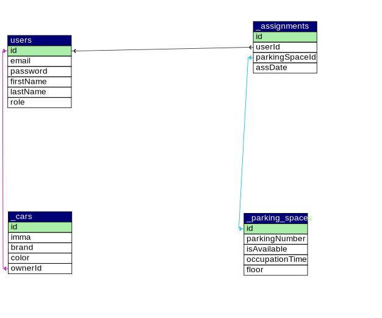
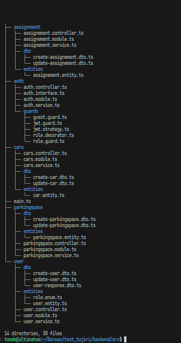

# 🚗 Parking Service Backend 🚗

## 📝 Description

This is the backend for the parking service. It's a powerful REST API that allows users to create, read, update, and delete parking lots and spaces. Plus, it lets users reserve parking spaces with ease.

## 🛠️ Requirements

- Node.js `node v20.*`
- NPM `npm v10.*`
- MySQL Database
- NestJS CLI `npm i -g @nestjs/cli`

## 🚀 Installation

1. Clone the repository
2. Run `npm install` to install the dependencies
3. Customize `TypeORM` configuration in AppModule.ts or use the default configuration by creating a database named `_parking_service` and running the migrations

## 🏃‍♂️ Running the app

1. Run `npm run start:dev` to start the app in development mode
2. Run `npm run start:prod` to start the app in production mode

## 📚 API Documentation

1. Run `npm run start:dev` to start the app in development mode
2. Visit `http://localhost:3000/api` to see the API documentation

## 📄 API JSON Collection

1. Run `npm run start:dev` to start the app in development mode
2. Visit `http://localhost:3000/api-json` to see the API JSON collection

## 📄 Database Model

  

## 📁 Project Structure

  

